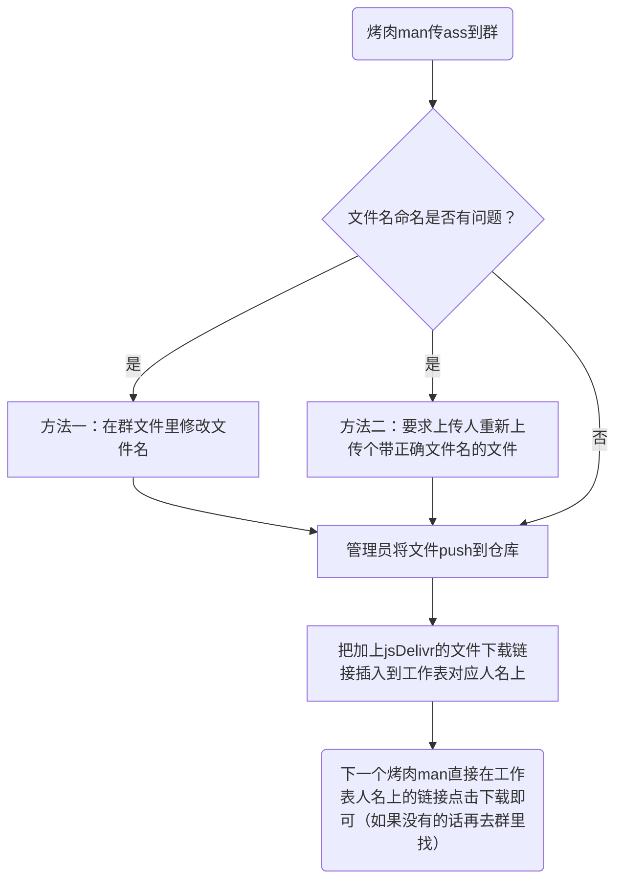

# 组内GitHub仓库管理办法

这个仓库更多作为创建下载链接用，但也可以寻找历史文件，管理员都已一一归档（`未归档`文件夹里的文件除外）。

## 管理员

当前管理员（目前都是制作进行在负责）有：

- Decmoe47（主）
- 久远千岁

## 文件夹分类

GitHub仓库上的文件分类是按照项目来的，具体如下：

- 📂`B限-年份`
  - 📁`项目`
    - 📃`文件`
    - 📂`子项目（如果有）`
      - 📃`文件（如果有）`
- 📂`油管-年份`
  - 📁`项目`
    - 📃`文件`
    - 📂`子项目（如果有）`
      - 📃`文件（如果有）`

※这里的年份是指项目名中的直播日期，并非项目的开始时间。

## Commit message格式规范

一般情况下格式为：

> **Create/Delete `文件名`**
>
> **Move `文件名` from `文件夹名` to `文件夹名`**
>
> **Move/Merge `文件夹名` into `文件夹名`**
>
> **Rename `文件名`/`文件夹名`**
>
> **Change `文件名`**（指文件内容修改过的情况）

其他情况请具体写明。

※这里的文件名包括了后缀名。

## 作用

组GitHub仓库管理员应及时将组员上传到群文件的字幕文件同步到仓库中，并将各个文件的下载链接添加到工作表对应的人名上。

今后上传依然上传到群文件，但下载既可以从工作表里的链接直接下载，也可以从群文件中下载。

所以今后大概这个流程：

